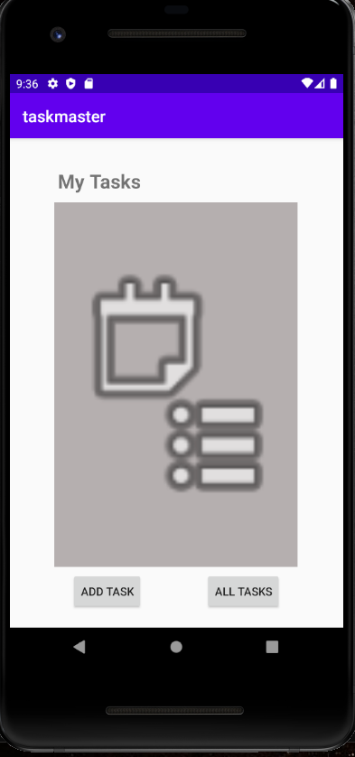
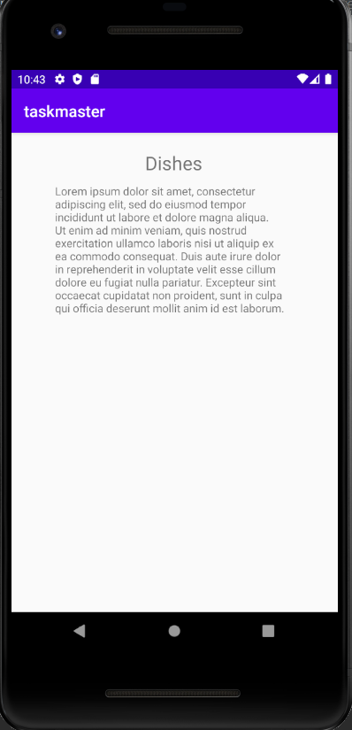
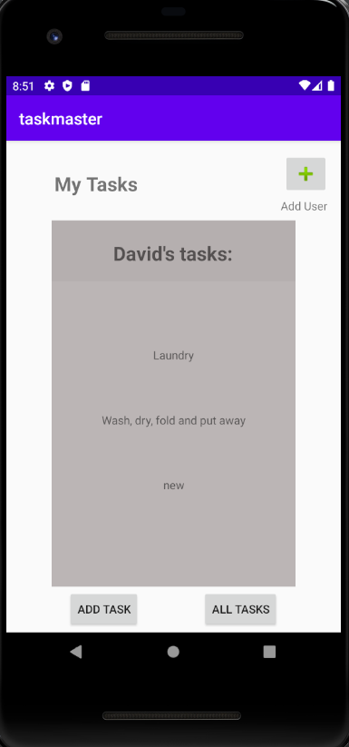
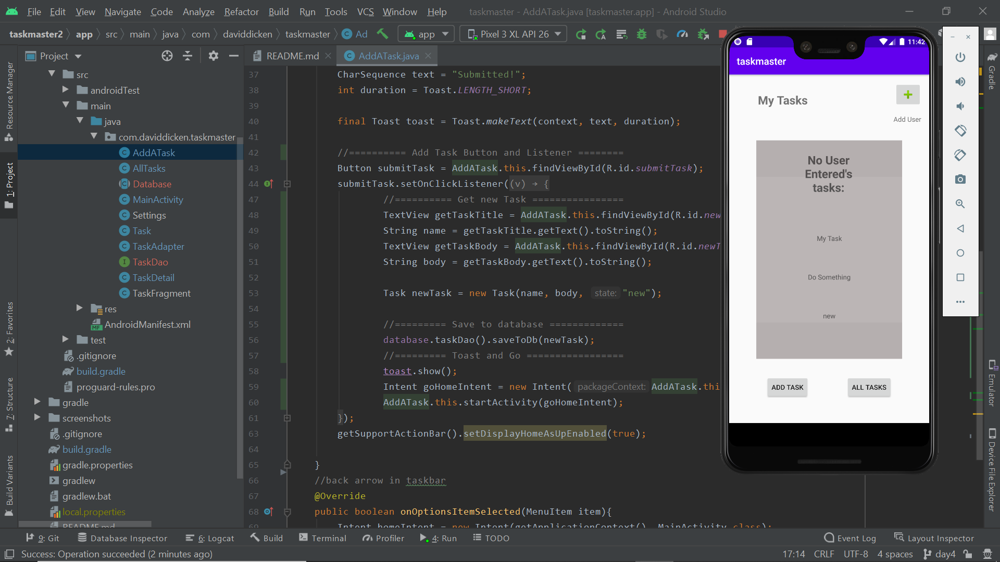
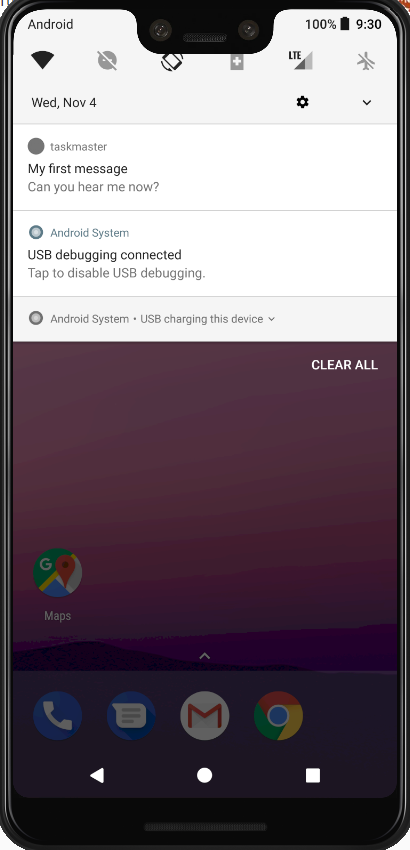
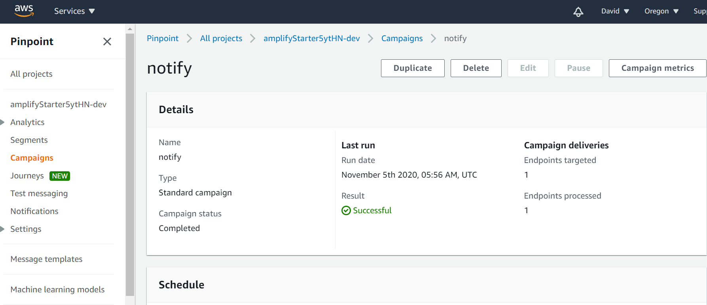
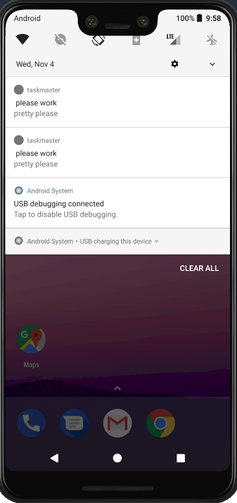
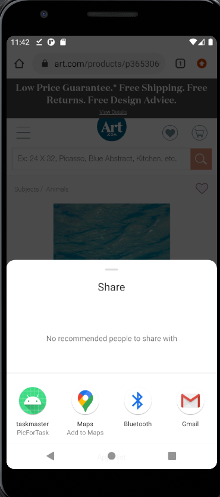
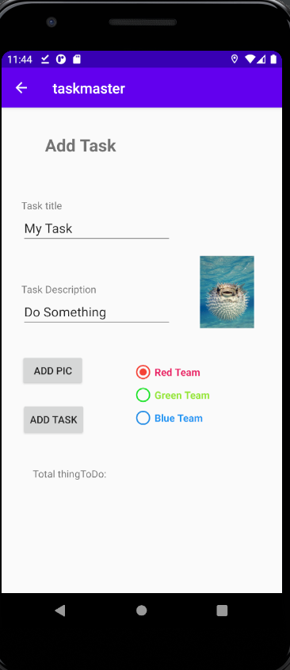
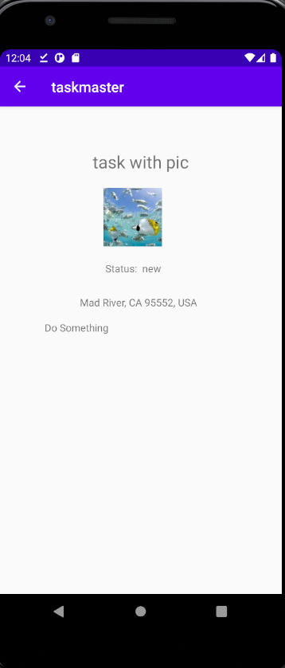

# Task Master
## Change log
## [2.0.0]

## 10/19/2020
## Change log [1.0.0]
## Day 1
Task Master is a app that will allow a user to create a thingToDo and view all thingToDos that they have
created.
Currently it has a home page with buttons that will take the user to either a add thingToDo page or a
view all page. Both of those pages have a back arrow in the action bar that has been wired up to
take the user home. On the add thingToDo page there is a submit button that has been wired up to display
a toast informing the user that the thingToDo was submitted.

Stay tuned, more is to come :)

--------------------------
## 10/20/2020
## Change log [1.0.1]
## Day 2
Today a Settings activity page where a user can enter their name. The name will be saved for use on
the main activity. There has also been three hardcoded thingToDos buttons added to the main page. When a
thingToDo button is clicked the user will be directed to a thingToDo details page and the title of the page
will be populated with the text from the button that was clicked.

------------------------
## 10/21/2020
## Change log [1.0.2]
## Day 3
Today a recyclerView was added to display a list of thingToDos on the home page that is scrollable. Clicking
On a thingToDo will take you to the thingToDo details page where a description, status, and thingToDo title are displayed.

-----------------------
## 10/22/2020
## Change log [1.1.0]
Day 4
Added the ability to save and pull from a database. Main page displays thingToDos that are found in the database.
And add a thingToDo page adds a thingToDo entered by the user to the database

-----------------------
## 10/26/2020
## Change log [1.1.0]
Day 5
Added test to test that username can be enter and then it will display on main activity,
test that a new thingToDo can be created and it will display on main activity,
test that you can click on a thingToDo on main activity and details about that thingToDo will be
displayed on thingToDo details activity

-----------------------
## 10/27/2020
## Change log [1.2.0]
Day 6
Changed database that the app was saving to and reading from to an online database (DynamoDB).

----------------------
## 10/28/2020
## change log [2.0.0]
Day 7
Added three teams and the ability to assign new tasks to a team. And the ability for a user to select
a team when the enter their name. Only the task for that users team will be displayed on the main page.

---------------------
## 11/4/2020
## change log [2.1.0]
Day 8
Set up the ability to send phone push notifications through AWS PinPoint or FireBase.

--------------------
## 11/10/2020
## change log [3.0.0]
Day 9ish
Added the ability for other apps to share images with app. Image is loaded to the add task page and can be
added to a task object. Also added location tracking when a new task is created the location is saved to
the task object. When a task is viewed on the task details page both image and location are display as well.

